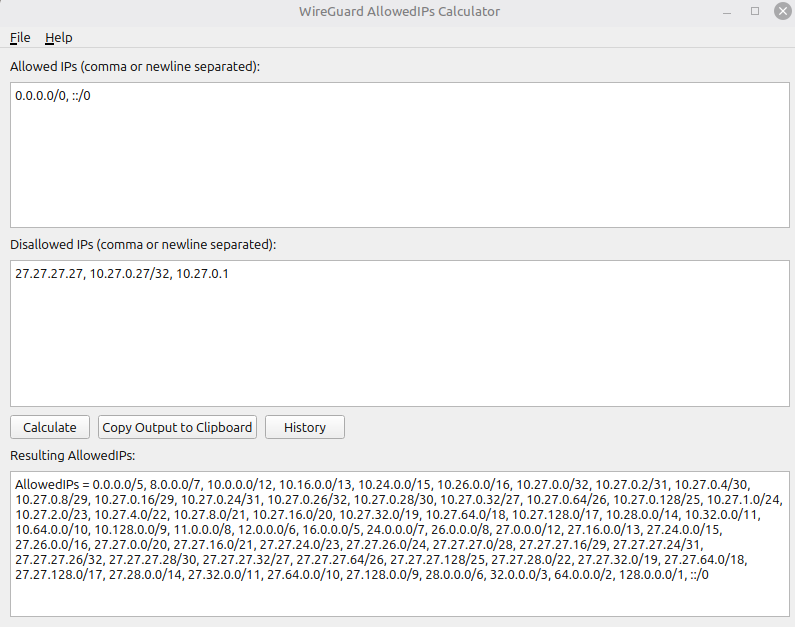

# WireGuard AllowedIPs Calculator

A cross-platform utility (Linux, Windows, macOS) for generating minimized
WireGuard **AllowedIPs** rules with support for:

- IPv4 + IPv6
- Calculation history
- GUI (PyQt5)
- CLI interface



Useful for advanced WireGuard routing setups where you want to express:

> `final_allowed = allowed_set − disallowed_set`

and get a compact `AllowedIPs = ...` line for your peer config.

---
## Features

### Core

- Accepts IPs, CIDRs, or a mix of both (IPv4 and IPv6)
- Supports large ranges such as `0.0.0.0/0` and `::/0`
- Subtracts arbitrary sets of disallowed IPs/networks
- Produces a *minimal* set of prefixes using `ipaddress.summarize_address_range`
  and `ipaddress.collapse_addresses`
- Output is WireGuard-ready:

```ini
AllowedIPs = 0.0.0.0/5, 8.0.0.0/7, ...
```

### Calculation history support

- Each calculation is appended to a history list with:
  - timestamp
  - allowed input
  - disallowed input
  - result string
- History is saved as JSON in the per-user config directory

### Persistent Config

The main window’s geometry (position & size) is stored in a `config.json` file
in the platform-appropriate config directory.
On next run, the window restores to the last saved position and size.

### CLI

A separate CLI wrapper script allows computing AllowedIPs logic from the shell
or scripts without using the GUI:

```bash
 python3 wg-ips-calc-cli.py -a "0.0.0.0/0, ::/0"   -d "27.27.27.27, 10.27.0.27/32, 10.27.0.1"
```

Outputs:

```text
AllowedIPs = 0.0.0.0/5, 8.0.0.0/7, 10.0.0.0/10, 10.64.0.0/13, ...
```

---

## Project Structure


```text
wg_ips_calc/
├─ wg_ips_core.py               # Calculation logic
├─ wg_ips_gui.py                # PyQt5 GUI
├─ wg_ips_cli.py                # CLI wrapper for core
├─ test_wg_ips_core.py          # Unit tests for the algorithm
├─ ...
└─ README.md
```

- `ips_core.py` exposes the main function:

```python
calculate_allowed_ips(allowed_text: str, disallowed_text: str) -> str
```

which returns a string like:

```text
AllowedIPs = 0.0.0.0/5, 8.0.0.0/7, ..., ::/0
```

---

## Algorithm Description

The core algorithm lives in `ips_core.py`. It follows these steps:

### 1. Parsing Inputs

Input text can contain:

- Single IPs: `10.0.0.1`, `37.27.12.178`, `2001:db8::1`
- CIDRs: `10.0.0.0/8`, `37.27.12.0/24`, `2001:db8::/32`
- Mixed with commas, spaces, or newlines

The function:

```python
parse_ip_list(text: str) -> List[ipaddress._BaseNetwork]
```

does the following:

1. Splits the string on commas and whitespace.
2. For each token:
   - If it contains `'/'`, it is parsed as a network via `ipaddress.ip_network(token, strict=False)`.
   - Otherwise, it is parsed as a single IP via `ipaddress.ip_address(token)` and converted to:
     - `ip_network(f"{addr}/32")` for IPv4
     - `ip_network(f"{addr}/128")` for IPv6

If any token is invalid, a `ValueError` is raised with a descriptive message.

We then split networks into IPv4 & IPv6 via:

```python
split_networks_by_ip_version(nets) -> (v4_list, v6_list)
```

### 2. Networks → Integer Ranges

Each network is represented as a closed interval `[start, end]` of integers:

```python
start = int(network.network_address)
end = int(network.broadcast_address)
```

This is done by:

```python
nets_to_ranges(nets) -> List[List[int]]
```

We maintain separate range lists for:

- `allowed_v4_ranges`
- `allowed_v6_ranges`
- `disallowed_v4_ranges`
- `disallowed_v6_ranges`

### 3. Range Subtraction

The core subtraction logic is:

```python
subtract_ranges(allowed_ranges, disallowed_ranges) -> List[List[int]]
```

Which applies `subtract_one_range_list` repeatedly.

`subtract_one_range_list` takes:

- `ranges`: list of inclusive `[a, b]` integer ranges
- `remove_range`: one inclusive `[c, d]` range

and returns a new list of ranges with `[c, d]` removed from all `[a, b]`.

Overlap cases for `[a, b]` (allowed) and `[c, d]` (disallowed):

1. **No overlap**  
   Conditions:
   - `d < a` or
   - `c > b`  
   Action:
   - Keep `[a, b]` unchanged.

2. **Full cover**  
   Condition:
   - `c <= a` and `d >= b`  
   Action:
   - Drop `[a, b]` completely.

3. **Partial overlap – disallowed cuts off left side**  
   Condition:
   - `c <= a <= d < b`  
   This means the disallowed range starts before or at `a` and ends somewhere in the middle of `[a, b]`.  
   Action:
   - Keep `[d + 1, b]`.

4. **Partial overlap – disallowed cuts off right side**  
   Condition:
   - `a < c <= b <= d`  
   Disallowed range starts inside `[a, b]` and continues past `b`.  
   Action:
   - Keep `[a, c - 1]`.

5. **Middle split**  
   Condition:
   - `a < c` and `d < b` (disallowed is strictly inside)  
   Action:
   - Split `[a, b]` into two allowed ranges:
     - `[a, c - 1]`
     - `[d + 1, b]`

This is applied for each disallowed range in sequence for both IPv4 and IPv6.

### 4. Integer Ranges → CIDR Networks

After subtraction, we have a list of disjoint integer ranges that are:

- strictly within the original allowed space
- not overlapping any disallowed range

We convert each `[start, end]` range back into minimal CIDR networks with:

```python
ipaddress.summarize_address_range(first_ip, last_ip)
```

and then simplify with:

```python
ipaddress.collapse_addresses(...)
```

This is implemented as:

```python
ranges_to_networks(ranges, version) -> List[ipaddress._BaseNetwork]
```

where `version` is 4 or 6.

For IPv4 we use `ipaddress.IPv4Address`, for IPv6 `ipaddress.IPv6Address`.

The resulting networks are sorted by their starting address. Finally, IPv4 and
IPv6 lists are concatenated (IPv4 first, then IPv6) and formatted into a single
string:

```text
AllowedIPs = <cidr1>, <cidr2>, ..., <cidrN>
```

This is returned by:

```python
calculate_allowed_ips(allowed_text, disallowed_text) -> str
```

If the allowed field is empty, a `ValueError` is raised.

---

## Unit Tests

Unit tests live in `test_wg_ips_core.py` and cover:

- Parsing of single IPs and CIDRs
- Error behavior on invalid inputs
- Simple subtraction cases:
  - e.g. `10.0.0.0/24` minus `10.0.0.128/25` → `10.0.0.0/25`
- The “large example” scenario (like the one in the prompt), verifying:
  - result begins with expected prefixes
  - specific prefixes are present (e.g. `10.74.0.0/32`, `10.74.0.2/32`)
  - some sanity checks ensuring disallowed IPs are not contained in resulting nets

Run tests with:

```bash
python3 -m unittest test_wg_ips_core.py
```

---

## Running the GUI

Install dependencies:

```bash
pip install PyQt5
```

Then run:

```bash
python3 wg_ips_gui.py
```

## Running the CLI

The CLI wrapper uses the same logic as the GUI, but reads inputs from flags:

```bash
python3 wg_allowed_ips_cli.py   -a "0.0.0.0/0, ::/0"   -d "37.27.12.178, 10.74.0.3/32, 10.74.0.1"
```

or with short flags:

```bash
python3 wg_allowed_ips_cli.py   -a "10.0.0.0/8"   -d "10.0.0.1, 10.0.0.2"
```

Result is printed to stdout; you can redirect it or capture it in scripts.

---
## Config & History Locations

Config directory depends on OS (done in `get_config_dir()`):

### Linux

```text
~/.config/wg-ips-calc/
```

### macOS

```text
~/Library/Application Support/wg-ips-calc/
```

### Windows

```text
%APPDATA%\wg-ips-calc\
```

Inside that directory:

- `config.json` – window geometry:
  - `x`, `y`, `w`, `h`
- `history.json` – list of history entries, like:

```json
[
  {
    "timestamp": "2025-12-03T01:23:45",
    "allowed": "0.0.0.0/0, ::/0",
    "disallowed": "37.27.12.178, 10.74.0.3/32",
    "result": "AllowedIPs = 0.0.0.0/5, 8.0.0.0/7, ..."
  }
]
```
## Building deb package

Install required packages:
```
sudo apt-get install git devscripts build-essential lintian upx-ucl
```
Run build:
```
./build_deb.sh
```
## License

MIT.
